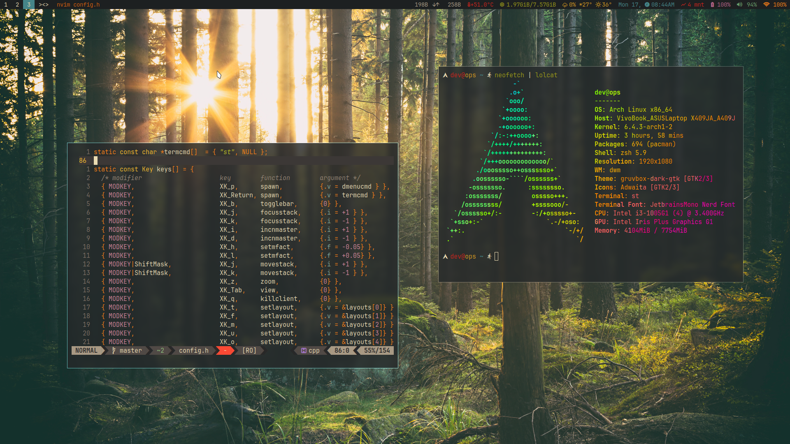

# **ZERO TO HERO ARCH LINUX**

Copyright © 2023 [04burhanuddin](https://github.com/04burhanuddin)

**Warning**: Don't blindly use configurations on dwm, st, dmenu and dwmblocks, unless you know what they require. Use at your own risk!.



## Table Of Contents

- Install Arch Linux
- Install GIT
- Mount Smartphone
- Menggunakan Github-CLI
- Menggunakan SSH Keys
- Install Editor
- Install Window Manager
- AUR Helper
- Install ZSH & Plugin ZSH
- Install Browser
- Install Picom
- Touchpad Error
- Install Firewall
- Install Apache
- Install Mysql
- Install PHP
- Install Composer
- Laravel Global Installer
- Install Node JS Using NVM
- Install Golang
- Install Python
- Install Java
- Install Android Studio
- Install Visual Studio Code
- Install Flutter
- Configure Input & Output Audio
- Install Bluetooth
- Manage Font
- Set Wallpaper
- Install Neofetch
- Setup Neovim
- Cara Screenshoot
- Others Package

## **Install Arch Linux**

> **Gunakan VirtualBox Untuk experiment, jika masih ragu untuk menggunakan Arch Linux**

- [Download Arch Linux](https://geo.mirror.pkgbuild.com/iso/2023.06.01/) - Download iso file
- [Balena Eatcher](https://etcher.balena.io/) - Creating bootable
- Sebelum lanjut instalasi pastikan kamu memiliki koneksi internet yang cukup stabil. **wajib konek ke internet**

**PANDUAN INSTALASI:**

- Masuk ke menu `boot` seperti biasanya, pada `boot option pilih` usb penginstalan tekan `enter`
- Next pilih menu `Arch Linux Install Medium...` dan tunggu sampai masuk ke `tty1`
- Setelah masuk ke tty1 silahkan konek ke `wifi` dengan cara berikut ini:

  ```shell
  # ketikkan perintah ini pada terminal tty1 dan nanti masuk ke mode iwctl
  iwctl

  # untuk mendapatkan device list contoh wlan0
  device list

  # menampilkan semua list wifi yang tersedia
  station wlan0 get-networks
  # konek ke wifi
  station wlan0 connect ENTER_SSID
  # atau
  iwctl --passphrase=PASSPHRASE station wlan0 connect SSID

  # exit iwctl CTRL + D / ketik exit
  ```

- Setelah itu uji coba koneksi melakukan test `ping`, misal `ping google.com`
- Lakukan update dan install package `archinstall`, `archlinux-keyring`

  ```shell
  pacman -Syu archinstall archlinux-keyring
  ```

- Setelah semua update dan instalasi package selesai tinggal install menggunakan perintah

  ```shell
  archinstall
  ```

   > Tunggu sampai masuk ke menu instalasi

   **Konfigurasi Instalasi:**

  - `Arch language` (default English) tidak perlu di ubah
  - `Keyboard layout` (default US) skip tidak perlu di ubah
  - `Mirror region` bebas mau di atur atau tidak (saran tidak usah)
  - `Locale language` (skip tidak perlu di ubah en_US default)
  - `Locale encoding` (skip tidak perlu di ubah utf-8 default)
  - `Drive(s)` (Pemilihan lokasi instalasi) *Tab to select*
  - `Disk layout` (**Note:instalasi full**) jadi pilih: wipe all selected... pilih `ext4` untuk filesystem
  - `Bootloader` (skip saja)
  - `Swap` (skip default true)
  - `Hostname` (atur sesuai keinginan)
  - `Root Password` (gunakan password yang mudah kamu ingat sendiri dan susah di tebak oleh orang)
  - `User account` (silahkan tambahkan user baru, user dan password jangan sampai lupa)
  - `Profile` (atur Pilih xorg) install a minimal ... dan untuk `graphics driver` select all
  - `Audio` (pilih `pipewire`)
  - `Kernals` (skip saja default `linux`)
  - `Additional package` (skip saja biar tidak lama saat proses instalasi)
  - `Network configuration` (pilih Use network manager....)
  - `Timezone` (disesuaikan saja, saya menggunakan asia/jakarta)
  - `Automatic time sync` (skip default true)
  - `Optional repository` (skip)
  - **Terakhir pilih install** and enter continue
  - Tunggu sampai selesai dan setelah itu `reboot` dan masuk kembali login dengan user yang telah dibuat.
  
- Test koneksi internet apakah masih terhubung dengan cara melakukan `ping google.com`
- Jika koneksi time out gunakan cara ini untuk konek ke jaringan `wifi` baca lengkap [https://wiki.archlinux.org/title/NetworkManager](https://wiki.archlinux.org/title/NetworkManager)

   ```shell
   # kamu bisa mempelajari dulu nmcli ini melalui link di atas
   nmcli

   # mendapatkan list wifi
   nmcli dev wifi list

   # konek ke wifi
   sudo nmcli dev wifi connect NETWORK_SSID password "NETWORK_PASSWORD"
   # Note: jika ssid nya menggunakan spasi gunakan tanda "NETWORK_SSID" atau SSID\ ...
   
   # melihat koneksi
   nmcli connection show

   # cek koneksi internet
   ping google.com -c5
   ```

## Install Git

```shell
sudo pacman -S git
```

> **Note:** Berhasil install git tapi belum tentu bisa bebas clone repository yang ada di github dikarenakan membutuhkan authentication `git credential` untuk itu ikuti langkah di bawah **Menggunakan SSH** atau **Menggunakan Github-CLI**

## AUR Helper

Sebenarnya ada beberapa AUR Helper yang dapat digunakan tapi saya lebih merekomendasikan untuk menggunakan `paru` selengkapnya baca dokumentasi, alasan mengapa menggunakan `paru` [https://wiki.archlinux.org/title/AUR_helpers](https://wiki.archlinux.org/title/AUR_helpers)

```shell
git clone https://aur.archlinux.org/paru.git
cd paru
# menginstall install AUR Helper
makepkg -si
```

## Cara Mount Smartphone

> Untuk mount External HDD/Flashdisk baca di sini [https://wiki.archlinux.org/title/USB_storage_devices](https://wiki.archlinux.org/title/USB_storage_devices)

Mengapa `mount` smartphone, agar memudahkan mendapatkan token maupun SSH keys, kamu bisa membuat sebuah file .txt di `smartphone` untuk menyimpan `token` yang telah kamu buat di akun github kamu tinggal copy dari `smartphone` ke PC/Laptop kamu dengan cara mount, begitupun dengan kamu bisa copy file ssh keys yang telah dibuat ke dalam `smartphone` untuk memudahkan menempelkan ssh key pada akun github kamu.

```shell
# gunakan SIMPLE-MTPFS bisa di install dengan menggunakan AUR Helper
# di sini saya menggunakan paru dan package ini hanya tersedia di aur helper
# instalasi menggunakan pacman tidak tersedia
paru -S simple-mtpfs
# pilih yang no 1 simple-mtpfs

# contoh buat directory baru untuk mount nantinya
mkdir phone

# untuk melihat list device, pastikan hp dan laptop sudah terhubung
simple-mtpfs -l

# mount menggunakan perintah
simple-mtpfs --device 1 ~/phone

ls phone
# sekarang kamu bisa transfer file dari laptop ke hp atau dari hp ke laptop

# untuk umount sebelum USB dicabut
fusermount -u phone
```

**Tips Copy ssh Github** - Skip ini lanjut ke membuat ssh-key dan kembali untuk baca bila perlu

Gunakan perintah ini untuk copy file ssh keys kamu ke `smartphone`

```shell
# ikuti langkah di bawah menggunakan ssh untuk membuat ssh key
cp .ssh/dev.pub phone/ssh.txt
# ganti ke .txt untuk memudahkan ketika di buka pada smartphone
```

> Sekarang kamu memiliki ssh key ada di penyimpanan external `smartphone` kamu tinggal dibuka, copy semua kemudian paste pada SSH Key di pengaturan github kamu. Bebas menggunakan `browser` apa saja untuk login ke akun github, setelah login masuk settings -> SSH and GPG key -> New SSH Key -> title bebas -> key type `authentication key` -> Kye, dan paste key -> add SSH key -> **Lanjut di menggunakan SSH Key**

## Menggunakan Github-CLI

[Docs Github CLI](https://docs.github.com/en/github-cli/github-cli/about-github-cli), silahkan klik link untuk mempelajari `Github CLI` saya sendiri lebih suka menggunakan `SSH Key`

Jika belum memiliki token buat di pengaturan akun github settings -> developer settings -> personal access token -> token classic, silahkan atur `expired` dan `permission` penggunaan token

```shell
sudo pacman -S github-cli
gh auth login
# pilih github.com
```

> **Note:** Ikuti cara `mount` di atas agar tidak mengetik token satu-persatu.

## Menggunakan SSH Keys Github

[Docs SSH Keys](https://docs.github.com/en/authentication/connecting-to-github-with-ssh/generating-a-new-ssh-key-and-adding-it-to-the-ssh-agent)

**Membuat SSH Key untuk Github**

```shell
cd ~/.ssh
# jika belum memiliki directory .ssh buat terlebih dahulu mkdir .ssh

# membuat ssh key
ssh-keygen -t rsa -b 4096 -C "contoh@gmail.com"

Generating public/private rsa key pair.
Enter file in which to save the key (/home/dev/.ssh/id_rsa): ID_RSA_KAMU
Enter passphrase (empty for no passphrase):
Enter same passphrase again:
Your identification has been saved in ....
Your public key has been saved in ....pub
The key fingerprint is:
SHA256:SJ6tYaXowqW0CB..............
The key's randomart image is:
+---[RSA 4096]----+
|==o.o. .. . |
|B ++o.. . . |
|o+.=o.. . . |
|.oooo+ * . |
|. +.o B S o E|
|.+ = . o . . +.|
|. = . . o =|
| . .o+|
| ...o|
+----[SHA256]-----+
```

```shell
cat ~/.ssh/ID_RSA_KAMU.pub
# copy semua dan paste ke akun github kamu SSH Key

# start ssh-agent
eval "$(ssh-agent -s)"

# jangan gunakan file .pub
ssh-add ~/.ssh/ID_RSA_KAMU

# sebelum run, pastikan ssh keys sudah di pasang pada akun github.
ssh -T git@github.com
# fingerprint yes
# pastikan sudah sukses seperti ini
Hi ....! You've successfully authenticated, but GitHub does not provide shell access.
```

> Setelah komputer/laptop reboot, SSH key tidak bisa digunakan harus ditambahkan lagi baru bisa.

Nah biar ga ribet `ss-add ...` buat file baru dengan nama `config`

```shell
nvim ~/.ssh/config
```

copy dan paste ke dalam file `config`

```shell
# Github.com server
Host github.com
IdentityFile ~/.ssh/ID_RSA
```

> Kamu bisa membuktikannya dengan cara reboot tanpa file `config` setelah itu ketikkan `ssh -T git@github.com` dan ketika menggunakan file `config`

## Install Editor

Setelah penginstalan Arch Linux tidak ada editor bawaan, Saya sangat suka menggunakan `neovim`, gunakan text editor yang kamu pahami dan familiar buat kamu

```shell
# install semua sesuai kebutuhan saja
sudo pacman -S neovim
sudo pacman -S emacs
sudo pacman -S vim
sudo pacman -S nano
```

> install editor untuk konfigurasi langkah berikutnya

## Install Window Manager

Sebelum mendownload semua resource pastikan sudah membuat directory untuk menampung semua resources ini dengan menggunakan perintah berikut ini

```shell
mkdir -p .local/src

# jadi isi dari directory src ini adalah ada dwm, st, dmenu dan dwmblocks
# ikuti langkah di bawah untuk menginstall
```

Sebelum melakukan instalasi di bawah agar tidak terjadi error terlebih dahulu install package ini dan lakukan konfigurasi berikut ini

``` shell
sudo pacman -S libxft libxinerama

# kemudian copy
cp /etc/X11/xinit/xinitrc ~/.xinitrc
```

kemudian modifikasi file `.xinitrc` seperti dibawah ini

```shell
#!/bin/sh

userresources=$HOME/.Xresources
usermodmap=$HOME/.Xmodmap
sysresources=/etc/X11/xinit/.Xresources
sysmodmap=/etc/X11/xinit/.Xmodmap

# merge in defaults and keymaps
if [ -f $sysresources ]; then
    xrdb -merge $sysresources
fi
if [ -f $sysmodmap ]; then
    xmodmap $sysmodmap
fi
if [ -f "$userresources" ]; then
    xrdb -merge "$userresources"
fi
if [ -f "$usermodmap" ]; then
    xmodmap "$usermodmap"
fi
# start some nice programs
if [ -d /etc/X11/xinit/xinitrc.d ] ; then
 for f in /etc/X11/xinit/xinitrc.d/?*.sh ; do
  [ -x "$f" ] && . "$f"
 done
 unset f
fi

dwmblocks &
exec dwm
```

Disini kemu bisa menggunakan source saya maupun source dari orang lain tapi untuk belajar kedepannya tidak apa-apa untuk sementara saja, biar kedepannya kamu bisa mempelajari sendiri dan melakukan patch sesuai kebutuhan. dan ingat jangan harap kamu menemukan `Button Close`, `Button Minimize` dan `Button Maximize` di DWM ini dikarenakan full menggunakan **Key Bindings** kamu dapat mengatur key binds kamu di masing-masing file `config.h/config.def.h` perlu di ingat jika kamu mengubahnya di file `config.def.h` maka `config.h` harus di delete terlebih dahulu dan akan otomatis terbentuk saat install menggunakan `sudo make clean install` dan setiap perubahan harus diterapkan dengan cara ini yaitu dengan cara menginstall. selengkapanya baca-baca pada website resminya `suckless.org` atau liat tutorial di `youtube`

- [dwm.suckless.org](https://dwm.suckless.org/) - **Dynamic Window Manager**

   Install Default

   > Perlu di ingat kalo pake yang default tidak ada include patch jadi patch sendiri sesuai kebutuhna saja

   ```shell
   cd .local/src/
   git clone https://git.suckless.org/dwm
   cd dwm
   sudo make clean install
   ```

   Installation Dari Source saya

   ```shell
   cd .local/src/
   git clone https://github.com/04burhanuddin/dwm.git
   cd dwm
   sudo make clean install
   ```

   **Patch & Features (dwm v6.4)**

   1. [https://dwm.suckless.org/patches/fullgaps/](https://dwm.suckless.org/patches/fullgaps/) - Full Gaps
   2. [https://dwm.suckless.org/patches/status2d/](https://dwm.suckless.org/patches/status2d/) - Status2d
   3. [https://dwm.suckless.org/patches/xrdb/](https://dwm.suckless.org/patches/xrdb/) - xrdb
   4. [https://dwm.suckless.org/patches/alwayscenter/](https://dwm.suckless.org/patches/alwayscenter/) - Always Center
   5. [https://dwm.suckless.org/patches/hide_vacant_tags/](https://dwm.suckless.org/patches/hide_vacant_tags/) - Hide Vacant Tags
   6. Include function keyboard manage volume dan kecerahan layar
   7. dan kamu dapat menambahkan patch sendiri sesuai kebutuhan

   **Key Bindings/Shortcut keyboard.**

   1. `super + enter` -> Open terminal
   2. `super + q` -> Close Window
   3. `super + p` -> Open dmenu
   4. `super + 2` -> Switch Tab `1, 2, 3, 4 dst`
   5. `super + shift + q` -> Exit dwm
   6. `super + Click Kanan Mouse` -> resize window
   7. Key binds lainnya ada di file `config.h` dan atur sendiri sesuai kebutuhan

- [st.suckless.org](https://st.suckless.org/) - **Simple Terminal**

   Simple Terminal (ST) dari `Bugswriter` menurut saya ini sangat bagus namun ada kekurangan yaitu belum support `glyph wide support` dimana kondisi ni untuk menampilkan icon, tampil hanya sebagian saja bagian kiri tampil sempurna dan kanan akan terpotong, jadi caranya tinggal kamu tambahkan patch baru dari [download di sini](https://st.suckless.org/patches/glyph_wide_support/) -> Pilih yang `using boxdraw` tinggal di patch dan benar yang error selesai, hal ini saya alami ketika menggunakan `nvim-tree` untuk menampilkan icon file/directory dan bisa teratasi dengan menerapkan `glphy wide support` pilih khusu yang boxdraw. Dan pastikan sebelum patch sudah paham patch sebenarnya buat apa dll..

   Install Default

   > Perlu di ingat kalo pake yang default tidak ada include patch jadi patch sendiri sesuai kebutuhna saja

   ```shell
   cd .local/src/
   git clone git clone https://git.suckless.org/st
   cd st
   sudo make clean install
   ```

   Installation Dari Source Lain (from `Bugswriter`)

   ```shell
   cd .local/src/

   # silahkan kunjungi profile github nya.
   git clone https://github.com/Bugswriter/st.git
   cd st
   sudo make clean install
   ```

   Key Bindings/Shortcut keyboard

   1. `alt + c` -> copy character
   2. `alt + v` -> paste character
   3. key binds lainnya ada di file `config.h` dan atur sendiri sesuai kebutuhan

- [tools.suckless.org](https://tools.suckless.org/dmenu/) - **Dynamic Menu**

   Installation

   ```shell
   cd .local/src/
   git clone git clone https://git.suckless.org/dmenu
   cd dmenu
   sudo make clean install
   ```

- [Dwmblocks](https://) - **Dwmblocks**

   Installation Dari Source Lain

   > Jika kamu menggunakan dwm yang belum inclide patch `status2d` harap bagian `"^c#A89984^",` di hapus saja dan ganti jadi string kosong agar tidak terjadi error saat instalasi

   ```shell
   cd .local/src/
   git clone git clone https://github.com/Bugswriter/dwmblocks.git
   cd dwmblocks
   sudo make clean install
   ```

   Cara menampilkan informasi pada dwmblocks

   Pada intinya semua yang ditampilkan pada dwmblocks adalah script yang dibuat dan bisa di execute dengan cara menggunakan `chmod +x nama script` contohnya dapat kamu lihat di sini [Status Bar](https://github.com/LukeSmithxyz/voidrice/tree/master/.local/bin/statusbar), kamu dapat mendownload semua `raw` dan kemudian kamu simpan kedalam directory `.local/bin` dan pastikan sudah bisa di execute caranya gunakan `chmod` +x di sini artinya hanya bisa di execute pada directory itu saja dan agar bisa di akses atau di execute di lokasi manapun tambahkan path pada bash profile seperti ini `export PATH="$HOME/.local/bin/:$PATH"` dan sekarang semua script dapata kamu execute diluar dari directory bin tadi. perhatikan pada file `config.h` pada dwmblock

   **Next Terakhir** Install font terlebih dahulu `sudo pacman -S ttf-jetbrains-mono` agar bisa di jalankan, setelah itu jalankan perintah `startx`

## Install ZSH

```shell
sudo pacman -S zsh
sh -c "$(curl -fsSL https://raw.githubusercontent.com/ohmyzsh/ohmyzsh/master/tools/install.sh)"

# jika belum punya curl
sudo pacman -S curl
# setelah itu restart
```

Install plugin ZSH

```shell
# untuk memasang clone semua plugin ini
# autosuggestions plugin
git clone https://github.com/zsh-users/zsh-autosuggestions.git $ZSH_CUSTOM/plugins/zsh-autosuggestions

# zsh-syntax-highlighting plugin
git clone https://github.com/zsh-users/zsh-syntax-highlighting.git $ZSH_CUSTOM/plugins/zsh-syntax-highlighting

# zsh-fast-syntax-highlighting plugin
git clone https://github.com/zdharma-continuum/fast-syntax-highlighting.git ${ZSH_CUSTOM:-$HOME/.oh-my-zsh/custom}/plugins/fast-syntax-highlighting

#zsh-autocomplete plugin
git clone --depth 1 -- https://github.com/marlonrichert/zsh-autocomplete.git $ZSH_CUSTOM/plugins/zsh-autocomplete

# implementasi
# Open ~/.zshrc
# cari bagian plugins=(git)
# copy dan paste code dibawah ini kedalam plugins menjadi seperti ini
plugins=(git zsh-autosuggestions zsh-syntax-highlighting fast-syntax-highlighting zsh-autocomplete)
```

Baca juga [https://github.com/romkatv/powerlevel10k](https://github.com/romkatv/powerlevel10k)

> Kamu bisa explore lagi plugins yang lainnya.

## Install Browser

Bebas saja mau pake browser apa ada `qutebrowser`, `Brave`, `Google Chrome`, `Firefox`, `Microsoft Edge`, `surf` dll

```shell
sudo pacman -S qutebrowser
sudo pacman -S firefox

# yang lainnya bisa di install menggunakan aur helper
# atau bisa dengan tanpa aur helper dengan cara clone dari aur package
paru -S google-chrome
paru -S microsoft-edge-stable-bin
paru -S brave-bin

# surf dapat kamu lihat pada https://surf.suckless.org/
```

> Jangan di install semua, sesuai kebutuhan saja.

## Install Picom

Jadai DWM tidak menyediakan compositing maka dari itu akan aneh rasanya seperti patah-patah dll, dan `picom` adalah solusi yang paling tepat untuk mengatasi window manager yang tidak menyediakan compositor. baca lengkap [https://github.com/yshui/picom/wiki/](https://github.com/yshui/picom/wiki/) or [https://wiki.archlinux.org/title/picom](https://wiki.archlinux.org/title/picom)

```shell
sudo pacman -S picom

# buat konfigurasi baru
# buat directory config yang baru terlebih dahulu
sudo mkdir .config/picom/picom.conf

# copy file default configurasi
cp /etc/xdg/picom.conf .config/picom/

# buat link menuju ke config baru yang kita buat tadi
picom --config .config/picom/picom.conf

# kemudian modifikasi config sesuai kebutuhan shadow, rounded corners, transparansi dll.
sudo nvim .config/picom/picom.conf
```

## Touchpad Error

Sebenarnya tidak error cuman tidak berfungsi seperti touchpad normal biasanya, double tap tidak berfungsi

```shell
# buat file baru di directory xorg..
sudo nvim /etc/X11/xorg.conf.d/30-touchpad.conf
```

copy code ini ke dalam file 30-touchpad.conf save dan restart. `This Work For Me`

```xml
Section "InputClass"
Identifier "devname"
Driver "libinput"
  Option "Tapping" "on"
  Option "NaturalScrolling" "true"
EndSection
```

**Cara lain** gunakan Touchpad Synaptics [https://wiki.archlinux.org/title/Touchpad_Synaptics](https://wiki.archlinux.org/title/Touchpad_Synaptics)

## Install Firewall

Baca lengkap disini [https://wiki.archlinux.org/title/Uncomplicated_Firewall](https://wiki.archlinux.org/title/Uncomplicated_Firewall)

```shell
sudo pacman -S ufw

# manage ufw
sudo systemctl start ufw.service
sudo systemctl status ufw

# menampilkan lis profil aplikasi
sudo ufw app list

# melihat detail specific profile aplikasi
sudo ufw app info 'SSH'

# memberikan izin http/https connection
sudo ufw allow 'WWW Full'
sudo ufw allow http
sudo ufw allow https
# memberi izin dengan menggunakan port
sudo ufw allow 80/tcp
sudo ufw allow 'WWW Secure'
# allow specific ip address
sudo ufw allow from 192.168.0.10
# allow specific port range
ufw allow 6500:6800/tcp

# cara menghapus UFW rules
# menampilkan semua list
sudo ufw status numbered
# misal menghapus 2 nomor di dapat dari list
sudo ufw delete 2

# enable dan disable logs ufw
sudo ufw logging low
sudo ufw logging medium
sudo ufw logging high
sudo ufw logging off

# remove dan disable firewall
sudo ufw reset
sudo ufw disable

# to uninstall
sudo pacman -R ufw
```

## Install Apache

Konfigurasi lengkapnya baca di [Apache HTTP Server](https://wiki.archlinux.org/title/Apache_HTTP_Server) atau jika ingin menggunakan [Nginix](https://wiki.archlinux.org/title/nginx)

```shell
sudo pacman -S apache

# manage apache
sudo systemctl start httpd.service
sudo systemctl status httpd.service
```

## Install Mysql

```shell
sudo pacman -S mysql
# select 1 Mariadb

# install database
sudo mariadb-install-db --user=mysql --basedir=/usr --datadir=/var/lib/mysql

# manage mysql
sudo systemctl start mariadb.service
sudo systemctl start mysqld
sudo systemctl status mysqld


# secure mysql
sudo mysql_secure_installation

# menambahkan user baru
sudo mysql -u root -p

# switch ke mysql
MariaDB [(none)]> USE mysql;

# menampilkan semua user
MariaDB [mysql]> SELECT user, host FROM mysql.user;

# pastikan sudah change ke mysql seperti ini kemudian buat user baru dengan
MariaDB [mysql]> create user 'YOUR_USERNAME'@'localhost' identified by 'YOUR_PASSWORD';

# mengatur hak akses user
MariaDB [mysql]> GRANT ALL PRIVILEGES ON *.* TO 'YOUR_USERNAME'@'localhost' WITH GRANT OPTION;
MariaDB [mysql]> FLUSH PRIVILEGES;

# cek kembali
MariaDB [mysql]> SELECT user, host FROM mysql.user;
MariaDB [mysql]>quit;
```

## Install PHP

Perlu di ingat perintah ini digunakan untuk menginstall php dengan versi terbaru yang ada di package Arch Linux, jika ingin menginstall PHP versi lain gunakan AUR Helper. baca lengkap [https://wiki.archlinux.org/title/PHP](https://wiki.archlinux.org/title/PHP)

```shell
sudo pacman -S php


# enable module php, aktifkan module yang dibutuhkan saja
sudo nvim /etc/php/php.ini
```

## Install Composer

Selengkapnya [https://getcomposer.org/download/](https://getcomposer.org/download/)

```shell
php -r "copy('https://getcomposer.org/installer', 'composer-setup.php');"
php -r "if (hash_file('sha384', 'composer-setup.php') === 'e21205b207c3ff031906575712edab6f13eb0b361f2085f1f1237b7126d785e826a450292b6cfd1d64d92e6563bbde02') { echo 'Installer verified'; } else { echo 'Installer corrupt'; unlink('composer-setup.php'); } echo PHP_EOL;"
php composer-setup.php
php -r "unlink('composer-setup.php');"

# cek instalasi
composer --version
```

## Install Node JS Using NVM

Baca lengkap [https://github.com/nvm-sh/nvm](https://github.com/nvm-sh/nvm)

```shell
curl -o- https://raw.githubusercontent.com/nvm-sh/nvm/v0.39.3/install.sh | bash
```

Path otomatis akan ditambahkan pada bash profile, jika menggunakan `ZSH` pastikan baris ini ada pada baris bagian bawah, simplenya jika bisa menjalankan `nvm --version` keluar versi nvm, berarti barisnya sudah ada jika tidak bisa tambahkan secara manual, copy code di bawah ini dan paste pada bash profile yang digunakan.

```shell
export NVM_DIR="$HOME/.nvm"
[ -s "$NVM_DIR/nvm.sh" ] && \. "$NVM_DIR/nvm.sh" # This loads nvm
[ -s "$NVM_DIR/bash_completion" ] && \. "$NVM_DIR/bash_completion" # This loads nvm bash_completion
```

Next install `Node JS`

```shell
# untuk melihat semua version node js
nvm list-remote

# install node js
nvm install VERSI_NODEJS

# perintah ini untuk menginstall node js yan long time support
nvm install -lts

# manage node js, jika menginstall beberapa versi
nvm use VERSI_NODEJS
nvm alias default VERSI_NODEJS
```

## Install Golang

[Official Doc](https://go.dev/doc/install) Bca lengkap di sini. dan silahkan download golang yang ada di sana.

```shell
# pindah ke directory lokasi go yang sudah di download
cd downloads/
sudo rm -rf /usr/local/go && tar -C /usr/local -xzf go1.20.5.linux-amd64.tar.gz

# tambahkan ke bash profile
export PATH=$PATH:/usr/local/go/bin

# cek version go yang di install
 go version
```

## Inatall Python

[Referensi here](https://wiki.archlinux.org/title/python)

```shell
sudo pacman -Sy python-pip

# check version
python -v
```

> Untuk install python versi lainnya silahkan gunakan AUR Helper untuk menginstall nya

## Install Java

Baca lengkap [https://wiki.archlinux.org/title/java](https://wiki.archlinux.org/title/java)

```shell
# menggunakan java 17
sudo pacman -S jre17-openjdk

# cek java default profile
sudo archlinux-java status

# mengganti default java profile
sudo archlinux-java set YOUR_JAVA_VERSION
```

## Install Android Studio

Install Android Studio menggunakan AUR Helper

```shell
paru -S android-studio
```

Install Android Studio tanpa AUR Helper

```shell
git clone https://aur.archlinux.org/android-studio.git
cd android-studio
makepkg -si
```

**Untuk Flutter** perlu SDK manager, buka android studio yang sudah di install pilih -> SDK Manager -> SDK Tools -> centang `Android SDK Command-line Tools` download saja dan exit.

## Install Visual Studio Code

Install VS Code menggunakan AUR Helper

```shell
paru -S visual-studio-code-bin
```

Install VS Code tanpa AUR Helper

```shell
git clone  https://aur.archlinux.org/visual-studio-code-bin.git
cd android-studio
makepkg -si
```

## Install Flutter

[https://docs.flutter.dev/get-started/install/linux](https://docs.flutter.dev/get-started/install/linux) - Download flutter

```shell
# buat directory baru sebenarnya bebas saja, tapi disini buat directory baru saja biar rapih
# menggunakan titik biar tidak terlihat
mkdir .development

# pindahkan file flutter .tar.xz yang telah di download ke dalam directory .development

cd .development
# extract file .tar.xz setelah di extract hapus file flutter .tar.xz
tar xf flutter_linux_3.10.5-stable.tar.xz
rm flutter_linux_3.10.5-stable.tar.xz

# buat path pada bash profile dengan menggunakan perintah ini
export PATH="$PATH:`pwd`/flutter/bin"
# atau tambahkan manual
export PATH="$PATH:/home/YUR_USER/.development/flutter/bin"

# cek dependensi yang diperlukan
flutter doctor -v
# ikuti semua yang disarankan untuk di execute misal android license dll.

# manage flutter, recommended disable saja yang tidak diperlukan
flutter config --no-enable-web
flutter config --no-enable-macos-desktop
flutter config --no-enable-windows-desktop
flutter config --no-enable-linux-desktop
```

## Install Cisco Packet Tracer

Untuk menginstall `packet tracer` hanya bisa menggunakan package dari AUR Helper, jangan install menggunakan AUR Helper dikarenakan akan terjadi error berikut adalah caranya

[https://www.netacad.com/portal/resources/packet-tracer](https://www.netacad.com/portal/resources/packet-tracer) - Download packet tracer

```shell
# pertama clone dulu
git clone https://aur.archlinux.org/packettracer.git

# gunakan link di atas untuk mendownload packet tracer jika tidak punya akun silahkan buat dulu
# kemudian pindahkan file packet tracer ...deb yang telah di download kedalam directory yang di clone tadi.

# masuk ke dalam directory packet tracer dan install
cd packettracer

# pastikan file packet tracer yang .deb ada di dalam directory packet tracer kemudian install
ls
makepkg -si
```

## Laravel Global Installer

```shell
composer global require laravel/installer

# tambahkan path ini pada bash profile
export PATH="$HOME/.config/composer/vendor/bin:$PATH"


# check laravel global version
laravel --version

# create project laravel
laravel new PROJECT_NAME
```

## Configure Input & Output Audio

Jangan gunakan `pulseaudio` akan terjadi masalah, gunakan `pipewire` agar tidak terjadi masalah di audio input. Biar tidak ribet gunakan `pipewire`

```shell
sudo pacman -S pipewire pipewire-pulse


# kemudian copy code ini dan paste ke dalam file .xinitrc sebelum exect dwm
/usr/bin/pipewire &
/usr/bin/pipewire-pulse &
/usr/bin/pipewire-media-session &

# atau
pipewire &
pipewire-pulse &
pipewire-media-session &
```

Install package `pavucontrol` untuk mengontrol audio profile dengan GUI

```shell
sudo pacman -S pavucontrol
```

Jika sudah tinggal buka pavucontrol

## Install Bluetooth

Baca lengkap [https://wiki.archlinux.org/title/bluetooth](https://wiki.archlinux.org/title/bluetooth)

```shell
sudo pacman -S bluez bluez-utils

# manage bluetooth
systemctl enable bluetooth.service
systemctl start bluetooth.service
```

## Manage Font

[https://wiki.archlinux.org/title/fonts](https://wiki.archlinux.org/title/fonts) - Panduan menambahkan font yang lainnya

```shell
# fix emoji
sudo pacman -S noto-fonts-emoji

# buat file baru
sudo nvim /etc/fonts/local.conf
```

copy dan paste code ini kedalam local.conf save dan restart

```xml
<?xml version="1.0"?>
<!DOCTYPE fontconfig SYSTEM "fonts.dtd">
<fontconfig>
   <alias>
      <family>sans-serif</family>
      <prefer>
         <family>Noto Sans</family>
         <family>Noto Color Emoji</family>
         <family>Noto Emoji</family>
         <family>DejaVu Sans</family>
      </prefer>
   </alias>
   <alias>
      <family>serif</family>
      <prefer>
         <family>Noto Serif</family>
         <family>Noto Color Emoji</family>
         <family>Noto Emoji</family>
         <family>DejaVu Serif</family>
      </prefer>
   </alias>
   <alias>
      <family>monospace</family>
      <prefer>
         <family>Noto Mono</family>
         <family>Noto Color Emoji</family>
         <family>Noto Emoji</family>
      </prefer>
   </alias>
</fontconfig>
```

Lalu bagaimana cara mengatur default font interface install package ini

```shell
sudo pacman -S lxappearcnce-gtk3
```

Kemudian buka `lxappearcnce` untuk mengatur font pastikan kamu sudah menambahkan font di `.local/share/fonts/` ikuti laing di atas untuk menginstall font yang lainnya

## Set Wallpaper

Baca selengkapnya [https://wiki.archlinux.org/title/feh](https://wiki.archlinux.org/title/feh)

```shell
Sudo pacman -S feh

# contoh mengatur wallpaper click link di atas untuk detail
feh --bg-scale /path/to/image.file

# tambahkan baris ini pada .xinitrc
~/.fehbg &
```

## Cara Screenshoot

Sebenarnya banyak opsi yang bisa digunakan untuk mengambil tangkapan layar namun disini saya menggunakan `maim` dan sekaligus install package sxhkd untuk mengatur key bindings untuk melakukan screenshot. Baca Selengkapnya [https://man.archlinux.org/man/maim.1.en](https://man.archlinux.org/man/maim.1.en) - untuk screenshot opsi lainnya.

```shell
sudo pacman -S maim sxhkd


# menggunakan maim, perintah ini digunakan untuk mengambil tangkapan layar dan akan disimpan di directory home dengan nama screenshot.png
maim ~/screenshot.png


# mengambil screenshot dengan key binds
# buat sebuah file
sudo nvim .config/sxhkd/sxhkdrc


# copy dan paste code ini pada file sxhkdrc, modifikasi sesuai kebutuhan
super + shift + p
maim -s ~/pictures/screenshoot/$(date +%s).png


# -s adalah select jika tidak mau langsung saja tanpa -s click link di atas untuk opsi lainnya
# save dan jalankan
sxhkd &
# dan tambahkan sxhkd & pada file .xinitrc sebelum exac dwm
# screenshot dengan menggunakan key binds super + shift + p dan otomatis akan tersimpan di directory ~pictures/screenshot
```

## Install Neofetch

[https://github.com/Chick2D/neofetch-themes](https://github.com/Chick2D/neofetch-themes) - Theme Neofetch

```shell
sudo pacman -S neofetch
```

Run `neofetch` pada terminal dan foto kemudian upload di sosmed kamu dengan caption `I USE ARCH BTW` 🤣

## Setup Neovim

[Tutorial Neovim](https://www.youtube.com/watch?v=vdn_pKJUda8&t=2363s) - Sangat recomended implementasi sesuai kebutuhan saja.

## Others Package

- [htop](https://archlinux.org/packages/extra/x86_64/htop/) - Interactive process viewer
- [man page](https://wiki.archlinux.org/title/man_page) - A utility for reading man pages
- [wget](https://archlinux.org/packages/extra/x86_64/wget/) - Network utility to retrieve files from the Web
- [graphviz](https://archlinux.org/packages/extra/x86_64/graphviz/) - Graph visualization software
- [unzip](https://archlinux.org/packages/extra/x86_64/unzip/) - For extracting and viewing files in .zip archives
- [xorg-xrandr](https://archlinux.org/packages/extra/x86_64/xorg-xrandr/) - Primitive command line interface to RandR extension
- [LSD (LSDeluxe)](https://github.com/lsd-rs/lsd) - Sanget cool untuk menampilkan icon pada terminal
- [OBS-Studio](https://archlinux.org/packages/extra/x86_64/obs-studio/) - Free, open source software for live streaming and recording
- [sxiv](https://archlinux.org/packages/extra/x86_64/sxiv/) - Simple X Image Viewer
- [Figma Linux](https://aur.archlinux.org/packages/figma-linux) - The collaborative interface design tool. Unofficial Figma desktop client for Linux
- [MPD](https://wiki.archlinux.org/title/Music_Player_Daemon) - Music Player Demon
- [Spotify](https://wiki.archlinux.org/title/Spotify) - A proprietary music streaming service
- [kdenlive](https://archlinux.org/packages/extra/x86_64/kdenlive/) - A non-linear video editor for Linux using the MLT video framework
- [Cheese](https://archlinux.org/packages/extra/x86_64/cheese/) -  Take photos and videos with your webcam, with fun graphical effects
- [Scrcpy](https://archlinux.org/packages/extra/x86_64/scrcpy/) - Display and control your Android device
- [yt-dlp](https://archlinux.org/packages/extra/any/yt-dlp/) - A youtube-dl fork with additional features and fixes
- [Plant UML](https://plantuml.com/starting) - Untuk membuat diaram dll. Saya sering menggunakan untuk graphic seperti use case dll dengan menggunakan extension `vs code` Sebelum mulai kemu perlu menginstall package `graphviz`

## Tips & Tricks

- Saran saya sering-sering baca wiki arch linux karena disana sudah lengkap banget untuk dokumentasi dari setiap package-package yang tersedia pada package arch maupun AUR Package.
- Jangan takut untuk explore lebih dalam lagi tentang Arch Linux, tapi ingat hati-hati karena bisa beresiko fatal jika kebanyakan explore package, gunakan sesuai kebutuhan saja, jangan sampai memberatkan sistem kamu sendiri
- Modifikasi key bindings kamu sesuai keinginan kamu di setiap file `config.h` pada **dwm**, **dmenu**, **st** dan jika kamu mau melakukan patch, saran patch sesuai kebutuhan saja dan pastikan kamu sudah membackup file utama sebelum di otak-atik dan cari tutorial cara patch yang baik dan benar. [cara patch](https://suckless.org/hacking/)

## Butuh Bantuan 😂

[Discord](https://discordapp.com/users/04burhanuddin) - Contact
